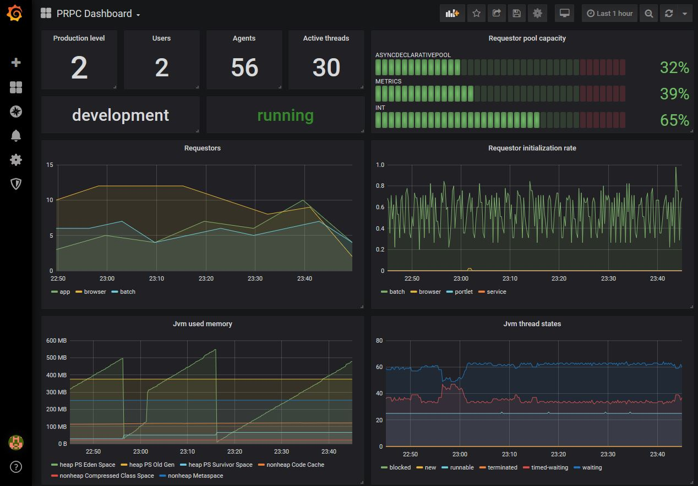

# micrometer-prpc
Pega PRPC + Micrometer = :heart:

Expose your business and technical metrics from Pega to any monitoring system.

This small library aims to simplify usage of [Micrometer](https://micrometer.io) for collecting metrics in 
[Pega PRPC](https://www.pega.com/products/pega-platform) environment. Developers can use familiar concept of 'rules'
to implement metric value sources.



|PRPC version|     tested       |
|:----------:|:----------------:|
|   7.3.0    |:heavy_check_mark:|
|   8.2.1    |:heavy_check_mark:|

Java 8+ required.

### Build
#### Prerequisites
In order to build the project locally, you have to satisfy dependency prerequisites.

This project does not include any dependencies or any proprietary code. 
It is intended to be used by authorized Pegasystems Inc clients in their Pega PRPC environments.

This library relies on some internal PRPC jars which usually could be found in 
`<pega-distributive>.zip/archives/pegadbinstall-classes.zip/lib`.

Libs:
- prpublic
- prprivate
- prenginext
- pricu2jdk
- prbootstrap
- prbootstrap-api

The following command will help to install the required jars to a local maven repository:
```
mvn install:install-file -Dfile=<path-to-prpc-libs>/<lib>-<version.prpc>.jar -DgroupId=com.pega.prpc -DartifactId=<lib> -Dversion=<version.prpc> -Dpackaging=jar
```

#### Package
After the required jars are installed you may use the following command to build project:
```
mvn package -Dversion.prpc=<version.prpc>
```

### Install
Deploy the following jars to the PRPC instance as usual (from UI or service):
- micrometer-core-\<version.micrometer>.jar
- micrometer-registry-\<registry>-\<version.micrometer>.jar - one or multiple registry libs and its dependencies 
- micrometer-prpc-\<version>.jar

### Use
Create sources:
```java
// Sql source
PrpcSource source = SqlSource.builder()
        .queryString("select ... from {CLASS:Some-Data-Class}")
        .groupPropName("pxPages")
        .expirationDuration(2)
        .expirationTimeUnit(TimeUnit.MINUTES)
        .build();

// Data Page source
PrpcSource source = DataPageSource.builder()
        .ruleName("D_SomeDataPage")
        .accessGroupName("Some:AccessGroup")
        .resultsPropName("pxResults")
        .groupPropName("pxPages")
        .expirationDuration(5)
        .expirationTimeUnit(TimeUnit.MINUTES)
        .build();

// Activity source
PrpcSource source = DataPageSource.builder()
        .ruleName("SomeActivity")
        .ruleClass("Some-Class")
        .accessGroupName("Some:AccessGroup")
        .resultsPropName("pxResults")
        .groupPropName("pxPages")
        .expirationDuration(10)
        .expirationTimeUnit(TimeUnit.MINUTES)
        .build();
```

Register metrics:
```java
// Create registry
MeterRegistry registry = ...

// Gauge - register single metric
registry.gauge("gauge.metric.name", source, PrpcCallback.strong("PropertyReference"));

// MultiGauge - register multiple metrics with unique tags
MultiGauge mg = MultiGauge.builder("gauge.metric.name").register(registry);
Iterable<MultiGauge.Row> rows = MultiMeter.rows(source, "PropertyReference");
mg.register(rows);

// Counter
registry.more().counter("counter.metric.name", Tags.empty(), source, PrpcCallback.strong("PropertyReference"));
```

For more information about micrometer features visit micrometer [docs](https://micrometer.io/docs) page.

### Prometheus example
1. Deploy libs:
- micrometer-prpc-\<LATEST>.jar
- micrometer-core-\<LATEST>.jar
- micrometer-registry-prometheus-\<LATEST>.jar
- simpleclient_common-\<LATEST>.jar
- simpleclient-\<LATEST>.jar

2. Implement startup agent:
```java
// Initialize registry and store it
MeterRegistry registry = new PrometheusMeterRegistry(PrometheusConfig.DEFAULT);
RegistryHolder.getInstance().put("prometheus", registry);

// Register meters which have constant tags cardinality during app lifetime
PrpcSource source = DataPageSource.builder()
        .ruleName("D_pzNodeInformation")
        .expirationDuration(2)
        .expirationTimeUnit(TimeUnit.MINUTES)
        .build();

registry.gauge("prpc.requestors", source, PrpcCallback.strong(source, "pxNumberRequestors"));
registry.gauge("prpc.agents", source, PrpcCallback.strong(source, "pxNumberAgents"));
registry.gauge("prpc.listeners", source, PrpcCallback.strong(source, "pxNumberListeners"));

registry.more().counter("prpc.requestors.initiated", Tags.of("type", "browser"), source, PrpcCallback.strong(source, "pxNumberBrowserInitiatedRequestorStarts"));
registry.more().counter("prpc.requestors.initiated", Tags.of("type", "batch"), source, PrpcCallback.strong(source, "pxNumberBatchInitiatedRequestorStarts"));
registry.more().counter("prpc.requestors.initiated", Tags.of("type", "service"), source, PrpcCallback.strong(source, "pxNumberServiceInitiatedRequestorStarts"));
```

3. Implement rest service:
```java
PrometheusMeterRegistry registry = (PrometheusMeterRegistry) RegistryHolder.getInstance().get("prometheus");
if (registry != null) {
    response = registry.scrape();
}
```

The following setup results to a response which looks like:
```
# HELP prpc_requestors_initiated_total  
# TYPE prpc_requestors_initiated_total counter
prpc_requestors_initiated_total{type="service",} 4.0
prpc_requestors_initiated_total{type="browser",} 1.0
prpc_requestors_initiated_total{type="batch",} 566.0
# HELP prpc_listeners  
# TYPE prpc_listeners gauge
prpc_listeners 0.0
# HELP prpc_requestors  
# TYPE prpc_requestors gauge
prpc_requestors 14.0
# HELP prpc_agents  
# TYPE prpc_agents gauge
prpc_agents 55.0
``` 

4. Configure Promehtheus to scrape service URL.